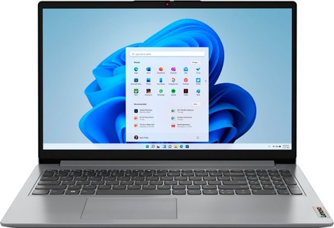

# Final-Assignment-
# Mikes Recommendation 
## Lenovo Ideapad

**The reviews on this laptop**
1. Most peoples say it gets the job done
2. They like the way the think pad looks
3. There are constant complants about how slow the laptop moves
4. This laptop would be good for small everyday usage not business.

# Shatavia Recommendation
## Intel Core i3

**Intel Core i3 Information**

1. The cost is $539.00
2. The CPU number is 898
3. CPU Model	Intel Core i3
4. Ram Memory Installed Size	16 GB
5. Customer's describe the laptop as easy to use and navigate. There only complaint is the fact that it doesn't have a keyboard light.
[Website](https://www.amazon.com/HP-Business-i3-1125G4-i5-1035G4-Accessories/dp/B0C3MPZXLQ/ref=sr_1_18?adgrpid=1341404748949050&hvadid=83838011873366&hvbmt=bp&hvdev=c&hvlocphy=72504&hvnetw=o&hvqmt=p&hvtargid=kwd-83838137381441%3Aloc-190&hydadcr=18032_13442871&keywords=business%2Bclass%2Blaptop&qid=1689607561&s=electronics&sr=1-18&ufe=app_do%3Aamzn1.fos.2b70bf2b-6730-4ccf-ab97-eb60747b8daf&th=1)

## Shatavia's Second Recommendation
Acer Swift 3

Chrome OS
Intel® Celeron® N4020 processor Dual-core 1.10 GHz
Intel® UHD Graphics 600 shared memory
14" Full HD (1920 x 1080) 16:9
4 GB, LPDDR4
64 GB Flash Memor
[Website link](https://store.acer.com/en-us/acer-chromebook-314-cb314-1h-c9gc)
- Light weight computer
- Highspeed in processing 
- CPU 4,682
- Price $549.00
